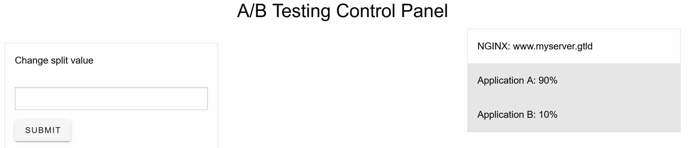

# A/B Testing using F5 DeviceID and NGINX+

I recently figured out how to use F5's DeviceID service with NGINX+ to perform A/B testing.
This is not only a cool and geeky thing to do, but I figured out it's very very useful.
Along the way, I also wrote a crude control panel page to let me change the split without resorting to curl :)

## TLDR - watch the meetup

At a recentish NGINX meetup I presented this - you can watch the [video](https://youtu.be/IfYSeYTKqHg?t=1375) if you're short on time.

## What is this?

This post is about an amalgam of several things.

1. A/B testing with NGINX+
2. Using the split_clients directive in NGINX+ to split traffic.
3. Controlling the split of traffic based on a dynamically updatable key value pair in NGINX+.
4. Using DeviceID as the mechanism for splitting the traffic (this means each device or browser instance).

## Why would I do this? (A lightbulb moment)
I had been looking at ways to use DeviceID with NGINX since it was released late last year.
The intention was to use it in a way that was not strictly a security related use case, but to use it in such way and for a purpose where I needed to have a fine grained view of a client identifier.

This is **very important** to me as a developer and a devops practitioner.

I thought to myself - "When I do A/B testing or canary testing, I have a need to identify the client to be able to split traffic"

**A LIGHTBULB WENT OFF**

I could use the deviceID as a unique identifier for identifying clients but also for directing the clients' to new versions of my application deployment.

## Built on the shoulders of giants

Like a lot of open source ideas, this is built on the shoulders of giants.
Specifically, two NGINX blogs that I have to mention.

Kevin Jones' excellent blog [here](https://www.nginx.com/blog/performing-a-b-testing-nginx-plus/)

and

Rick Nelson's excellent blog [here](https://www.nginx.com/blog/dynamic-a-b-testing-with-nginx-plus/)


## NGINX+ 

NGINX+ has a few key abilities that I'm going to use. 

I'm going to split clients' based on a variable.
I'm going to keep an in memory map of client to application.
I'm going to dynamically update the split values as a percentage.

### Split

The split functionality of NGINX is provided by the [split_clients](https://nginx.org/en/docs/http/ngx_http_split_clients_module.html) module.

This allows us to use NGINX to split incoming traffic by any arbitrary value or (importantly) a variable.


Here I set up several splits inside my configuration file. Each one points to **server A** and **server B** with a different amount of traffic being directed to each upstream.


```
        split_clients $unique_client_identifier $split0 {
            *   server_a;
        }
        split_clients $unique_client_identifier $split5 {
            5%  server_b;
            *   server_a;
        }
        split_clients $unique_client_identifier $split10 {
            10% server_b;
            *   server_a;
        }
        split_clients $unique_client_identifier $split25 {
            25% server_b;
            *   server_a;
        }
        split_clients $unique_client_identifier $split50 {
            50% server_b;
            *   server_a;
        }
        split_clients $unique_client_identifier $split75 {
            75% server_b;
            *   server_a;
        }
        split_clients $unique_client_identifier $split100 {
            *   server_b;
        }
```

If we look at the upstream configuration, it matches the *split_clients* directive above.

```
        upstream server_a {
            server SERVER_A_IP;
        }
        upstream server_b {
            server SERVER_B_IP;
        }
```

These sections of configuration will split based on the variable **unique_client_identifier** sending traffic to the upstream groups as configured in the *split_clients* directive.

This is fine and will work, however, I would need to reload the configuration if I wanted to change the split. 
While NGINX+ definitely has a dynamic reload option for zero downtime configuration. This is documented [here](https://www.nginx.com/faq/how-does-zero-downtime-configuration-testingreload-in-nginx-plus-work/) and [here](https://docs.nginx.com/nginx/admin-guide/basic-functionality/runtime-control/)

### Key value pair

NGINX+ has a feature called key value pair store. As the name suggests, it is a key value pair store.
NGINX+ also has the ability to update this dynamically using an API. (this is where things get interesting).

So let's set up a key value store.

```
        keyval_zone zone=split:64k state=/etc/nginx/state_files/split.json;
        keyval      $host $split_level zone=split;

```

The configuration snippet above does two things:

1. Sets up a shared memory zone
   - Gives the zone a name 
   - Sets the amount of memory to use for the zone
   - stores the values in a state file

2. Configures a key value store that will be stored in the shared memory zone.
   - using the [keyval](https://nginx.org/en/docs/http/ngx_http_keyval_module.html) directive to configure a keyval store and variables that will be stored in the **keyval_zone**.

In my case, my keyval store will store two values, the **split_level** which corresponds to the pre-defined percentage in the **split_clients** directive above. It will also store the **host** identifier. In my case I will be using the special host identifier deviceID (discussed below).

### Map

I am also using a map to enable me to effectively and easily set the keyval pair.

```
        map $split_level $upstream {
            0        $split0;
            5        $split5;
            10       $split10;
            25       $split25;
            50       $split50;
            75       $split75;
            100      $split100;
            default  $split0;
        }
```

The map allows me to set the upstream variable to the **split_clients** directives above. Essentially, this is the linkage between the split clients directive and the key value store.

## DeviceID

DeviceID is a very funky thing, and it's within budget - it's **free**.

The documentation for it is [here](https://clouddocs.f5.com/cloud-services/latest/f5-cloud-services-DeviceID-About.html).

More importantly the [FAQ](https://f5cloudservices.zendesk.com/hc/en-us/sections/360012008533-Device-ID-FAQs) has a really great description of the [dual identifier approach](https://f5cloudservices.zendesk.com/hc/en-us/articles/360060250913) that DeviceID uses.

### Why this is important

DeviceID is super important because it's a way of uniquely identifying a client. In this case, the client is a browser, but think of it as a "device identifier". Over time the identifier should become more accurate. 

The FAQ (above) has descriptions of various "split" operations and what the effect on the deviceID is.

For now - it's free, and is **super useful.**

It's very important because it gives me the ability to have **high precision** and **fine grained** device identification capabilities. 
It's completely up to me how I use these capabilities. 

Most of the use cases I have seen thus far are in fact security related, so I sat down one evening and tried think of one that **was not** security related, but was **super useful** in a developer context.

....here we are.

### What it gives me

Essentially, it's a bit of javascript you embedd on a page, it sends some signal information back to F5, and they provide you with two identifiers in the form of a cookie in the browser. 

**WHAT YOU DO WITH IT IS UP TO YOU**

```
{
    "diA": "AT9cyV8AAAAAd60uXCtYafPTZGLaVAku"
    "diB": "ASJ4gFmzPo/a8AHJceWhykudRoXeBGlP"
}
```

That's the sort of thing that you will get back. 

### Configuration for DeviceID

### Client side

Just include the appropriate **\<SCRIPT\>** tags in your application :)

### NGINX Configuration

The NGINX side of the house is fairly easy also.

The first part is the **cookie** variable. 
There is an inbuilt [cookie](http://nginx.org/en/docs/http/ngx_http_core_module.html#variables) variable as part of core NGINX. This can be used to extract a cookie value by name, and assign the value of the cookie to a variable. I am doing this so that I can easily identify which DeviceID cookie I am dealing with within the conifguration.

As the cookie directive gives you a **safe** ASCII  representation of the cookie value, I am using a **regex** to split down the cookie to something usable and unique. You will note that the value I get from the cookie directive includes **%22** for space and so on.

```

        map $cookie__imp_apg_r_ $dia {
          "~*(.+)(diA%22%3A%22)(?<found>.+)(%22%2C%22)" $found;
          default "unset";
        }
        map $cookie__imp_apg_r_ $dib {
          "~*(.+)(diB%22%3A%22)(?<p>.+)(%22%7D)" $p;
          default "unset";
        }
```

NGINX regex is fairly standard, but I did need to try a few times and dust off my brain to get exactly what I wanted. 

I **highly recommend** the NGINX regex tester. 

It is documented [here](https://www.nginx.com/blog/regular-expression-tester-nginx/) in an awesome blog post by Rick Nelson.


## API 

There's one last piece of the puzzle here. I need to enable to NGINX+ API in order to be able to update the keyval store using API calls.

The configuration for this looks like this:

```
            location /api {
                api write=on;
                # in production, directives restricting access
                add_header 'Access-Control-Allow-Origin' '*';
                add_header 'Access-Control-Allow-Methods' 'GET, POST, DELETE, PATCH, PUT, OPTIONS';
                add_header 'Access-Control-Allow-Headers' 'Content-Type, Accept';
                if ($request_method = OPTIONS) {
                  add_header 'Access-Control-Allow-Origin' '*';
                  add_header 'Access-Control-Allow-Methods' 'GET, POST, DELETE, PATCH, PUT, OPTIONS';
                  add_header 'Access-Control-Allow-Headers' 'Content-Type, Accept';
                  return 200;
                }
            }
```

This allows me to make API calls to NGINX.
The NGINX API is documented [here](http://nginx.org/en/docs/http/ngx_http_api_module.html)

Now you **should** include something like this:

```
        location /api {
            api write=on;
            allow 127.0.0.1;
            deny all;
        }
```

Exposing the API without appropriate security means that anyone can potentially access and write to your NGINX instance. Under most circumstances this would be very uncool.

I am going to use a VUE app to update the API, which means that I will need to cater for two types of requests. I need to cater for an **OPTIONS** request as well as a **POST** request.

Each request type needs to have the appropriate headers set so that the client can access the API.

For some reason I couldn't get the **OPTIONS** request to work without having a separate if statement - if you know why - please let me know.

## Testing

Once everything is provisioned and I have my config files set up, I can start to explore a few things.

Let's check my keyval pair

```
curl http://127.0.0.1/api/6/http/keyvals

{"split":{"www.myserver.gtld":"50"}}
```
This means that for the **INCOMMING** address of my server (www.myserver.gtld) the map **50** will be used.

We know from the previous configuration examples that the map of **50** looks like this:

```
        map $split_level $upstream {
            50       $split50;
        }

```
This will use the variable **$split50** which translates to this in our config file:

```
        split_clients $unique_client_identifier $split50 {
            50% server_b;
            *   server_a;
        }

```
In turn this splits traffic equally between my two upstream servers.


### Dynamically update the split

Now we can dynamically update the split values as well.
In order to do this, all we need to do is update the 

```
curl -iX PATCH -d '{"www.myserver.gtld":10}' http://localhost/api/3/http/keyvals/split

HTTP/1.1 204 No Content
Server: nginx/1.19.10
Date: Sun, 02 May 2021 10:39:16 GMT
Connection: keep-alive
Access-Control-Allow-Origin: *
Access-Control-Allow-Methods: GET, POST, DELETE, PATCH, PUT, OPTIONS
Access-Control-Allow-Headers: Content-Type, Accept
```

Then if I **GET** the value of my keyval pair I can see that it has been updated:

```
curl http://127.0.0.1/api/6/http/keyvals

{"split":{"www.myserver.gtld":"10"}}
```

## Vue control page

Updating the split using curl isn't that **dynamic** for the most part, so I wrote a small VUE app to do it for me.
The VUE app does a **POST** to the API on the NGINX server, and updates the setting accordingly.



The source code of the HTML page is fairly simple as well.

```
      const url = "http://www.myserver.gtld/api/6/http/keyvals/split"
      const vm = new Vue({
              el: '#keyval-state',
              data () {
                return {
                  results: null,
                }
              },
              mounted() {
                axios.get(url).then(response => {
                  this.results = response.data
                })
              }
            });
      const goo = new Vue({
         el: '#keyval-post',
         data: {
           counter: 0,
           splitpercent: ''
         },
         methods: {
           submit(){
             axios.get(url)
              .then((response) => {
                console.log(response.data["www.myserver.gtld"])
                axios.delete(url, { '"www.myserver.gtld"': response.data["x.x.x.x"] })
                  .then((response) => {
                    console.log(response)
                    axios.post(url, {'www.myserver.gtld': this.splitpercent})
                    location.reload();
                  })
              })
           } //end of submit
         } //end of methods
      });
```

You will of course note that very lazy and not reactive **location.reload();** at the end. I'll fix it one day!

The HTML code is siilarly simple.

```
    <div class="container" id="keyval-state">
      <h3 class="text-center">A/B Testing Control Panel</h3>
      <div class="columns medium-4" v-for="(result, index) in results">
        <div v-if="index" class="card">
          <div class="card-section">
            <p> NGINX: www.myserver.gtld</p>
          </div>
          <div class="card-divider">
            <p>Application A: {{ 100 - result }}%</p>
          </div>
          <div class="card-divider">
            <p>Application B: {{ result }}%</p>
          </div>
        </div>
      </div>
    </div>
    <div class="container" id="keyval-post">
      <div class="columns medium-4">
        <div class="card">
          <div class="card-section">
            <p> Change split value</p>
          </div>
          <div class="card-section">
            <input type="text" v-model="splitpercent">
            <v-btn type="submit" @click="submit">Submit</v-btn>
          </div>
        </div>
      </div>
    </div>

<div>
```

I am using [vuetify](https://vuetifyjs.com/en/) for some of the widgets. This just makes the button look nicer.

### Axios

A note on AXIOS - the library that I'm using the perform the **POST** to the NGINX API. Axios has one very very simple and elegant characteristic. The Axios library is 100% correct in its implementation of CORS. Essentially, the server needs to set the headers that are accepted from the client. Axios will adhere to these headers in a strict fashion. If the server does **not** set a header as an **accept** then the axios client will **not** send the header even if you explicitly attach it. This is the reason that my configuration explicitly sets **OPTIONS** headers for the /api location.

This is documented [here](https://github.com/axios/axios/issues/891#issuecomment-418836831)

As the github issue points out, it is up to the client implementation how it handles server headers. The Axios client is a strict or literal interpretation, and during the preflight or **OPTIONS** portion, the client will determine which headers the server is willing to accept.

...just something to be aware of as it will save you **hours** of troubleshooting.

## What's it all look like?

Each of the different browsers is directed to a different version of the application that I have deployed. This is because I have a different deviceID for each browser, and each browser is being split by the **split_clients** directive and forwarded to a different upstream server. 


Same app - diferent versions!

### Logging Configuration

The logging configuration to show this is relatively simple.

```
        log_format kv 'sourceip=$remote_addr ' '_imp_apg_r_=$cookie__imp_apg_r_' ' _imp_di_pc_=$cookie__imp_di_pc_' ' $http_user_agent' ' dia=$dia' ' di
b=$dib';
```

To reference this format, I use the following directive

```
        server {
            access_log /var/log/nginx/access.log kv;
            listen 80;
	    ...
        }
```

### Logs

A snippet of my logs is below. 

You can see from the logs that the source is the same IP address. The **user agent** is different because I am using different browsers. I am using both Firefox and Safari on the same client PC. I get two different device IDs. 

**Each browser has a unique identifier and is treated as a separate client!**

```
sourceip=10.1.1.10 _imp_di_pc_=ARCYjmAAAAAAO5ubqSLrae52At2vmPFL Safari/537.36
sourceip=10.1.1.10 _imp_di_pc_=ARCYjmAAAAAAO5ubqSLrae52At2vmPFL Safari/537.36
sourceip=10.1.1.10 _imp_di_pc_=ARCYjmAAAAAAO5ubqSLrae52At2vmPFL Safari/537.36
sourceip=10.1.1.10 _imp_di_pc_=ARCYjmAAAAAAO5ubqSLrae52At2vmPFL Safari/537.36
sourceip=10.1.1.10 _imp_di_pc_=AfuXjmAAAAAAHsisXx4rVFUrEcZG0uuP Firefox/88.0
sourceip=10.1.1.10 _imp_di_pc_=AfuXjmAAAAAAHsisXx4rVFUrEcZG0uuP Firefox/88.0
sourceip=10.1.1.10 _imp_di_pc_=AfuXjmAAAAAAHsisXx4rVFUrEcZG0uuP Firefox/88.0
sourceip=10.1.1.10 _imp_di_pc_=AfuXjmAAAAAAHsisXx4rVFUrEcZG0uuP Firefox/88.0
sourceip=10.1.1.10 _imp_di_pc_=AfuXjmAAAAAAHsisXx4rVFUrEcZG0uuP Firefox/88.0
```


## What's next?

Well - the next adventure is more than likely going to be using DeviceID and NGINX javascript in such a way to usefully store the deviceID and do something useful with it (not security related of course) :)


## About me
I am a devops solution architect and I work for F5 - F5 owns both the free super flexible deviceID product, and also the eminently cool NGINX.
